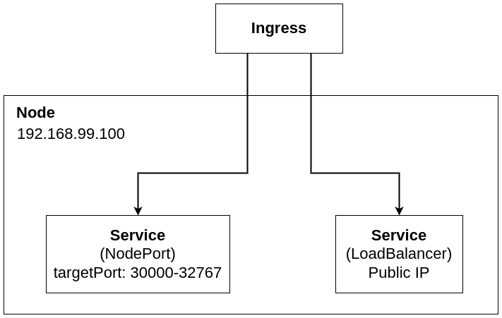

# Ingress

- Ingress expose HTTP and HTTPS routes from outside the cluster to services within the cluster

- Traffic routing is controlled by rules defined on the Ingress resource

- Ingress can be configured to do the following:
    - Give Services externally- reachable URLs

    - Load balance traffic

    - Terminate SSL/TLS
    
    - Offer name based virtual hosting

- An Ingress controller is used to realize Ingress

## Rules

- `host` (optional): If no host is specified, the rule applies to all inboud HTTP traffic

- a list of `paths`: Each path has its own backend. Paths can be exposed as a POSIX regular expression

- The `backend`, which consists of a `serviceName` and `port.number`. These match k8s API service objects. It is common to configure a default backend in an Ingress controller for incoming traffic that doesnt match a specific path

    - Simple fanout: traffic is routed to multiple backends, which allows u to minimize the number of LBs

    - Name based virtual hosting: traffic incoming on a specific name is routed to specific service

    - TLS Ingress: Uses a TLS secret to ensure TLS termination to be happening at the load balancer

## Ingress Controller

- Creating Ingress resources withou Ingress controller has no effect

- Ingress controller exist:
    - nginx
    - kong
    - haproxy

- To enable the minikube addon, use `minikube addons enable ingress`

