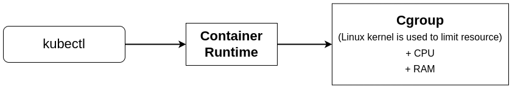

# Pod

- A Pod is an abstraction of a server

- It can run multiple containers within a single NameSpace, exposed by a single IP address

- k8s manage pods, not containers

- Typically, pods are only started through a deployment, because naked pods are not rescheduled in case of node failure


## Multi-Container Pod

- Typically, just one container is offered is offered through a Pod

- Single container Pods are easier to build and maintain

- There some cases where you might want to run multiple containers in a Pod

    - Sidecar container: a container that enhances the primary app, ex: logging

    - Ambassador container: a container that reporesents the primary container to the outside world, ex: proxy

    - Adapter container: used to adopt the traffic or data pattern to match the traffic or data pattern in other apps in the cluster

- Containers in a pod typically share data through shared storage

### Sidecar Scenario

- A sidecar container is providing additional functionality to the main container, where it makes no sense running this functionlity in a separate pod

- Think of loggingg, monitoring, syncing

- The essence is that the main container and the sidecar container have acess to shared resource to exchange info

- Often, shared volumes are used for this purpose


## Namespace

- a Namespace implements kernel level resource isolation

- k8s offers namespace objects that provide the same functionality

- Different Namespace can be used to strictly separate between customer resources

- Use kubectl ... -n ns to work in a specific Namespace

- Use kubectl get ... --all-namespaces to see resources in all namespaces

## Inspecting Pod


- Connect to a pod:
```
kubectl exec -it pod-name -- sh

kubectl exec -it pod-name -c container-name /bin/bash

```

- Port forwarding
```
kubectl port-forward pod/nginx 8080:80
```

## Monitoring

- Use `kubectl get pods` to get an overview of all pods and their current state

- More advanced pod monitoring should happen from the point of view of application monitoring: dont just monitor the individula pod, but the deployment of which it is a part

- Advisor: a more advanced monitoring agent that integrated with kubelet to get performance data about k8s components

- Prometheus: a more advanced monitoring solution that allows u to minitor pods as well as nodes

## Security Context

- a `SecurityContext` defines privilege and access control settings for a pod or container and includes:
    - Discretionary Access Control which is about permissions used to access an object
    
    - Security Enhanced Linux,where security labels can be applied

    - Running as privileged or unprivileged user

    - Using Linux cappabilities

    - AppArmor which is an alternative to SELinux

    - `AllowPrivilegeEscalation` which controls if a process can gain more privileges than its parent process


## Resource Limit



- By default, a pod will use as much CPI and memory as necessary to do its work

- This can be managed by using Mem/CPU `requests` and `limits` in `pod.spec.containers.resources`

- CPU limits are expressed in millicore or millicpu, 1/1000 of a CPU core

- Mem limits can be set also and are converted to the --memory option that can be used by the docker run command (or anything similar)

- When being scheduled, the `kube-scheduler` __ensures that the node running the pods has all requested resources available__


## Init Container

- An init container is an additional container in a pod that completes a task before the regular container is tarted

- The regular container will only be started once the init container has  been stated

- As long as the init container has not been stated, the main container is not started either

