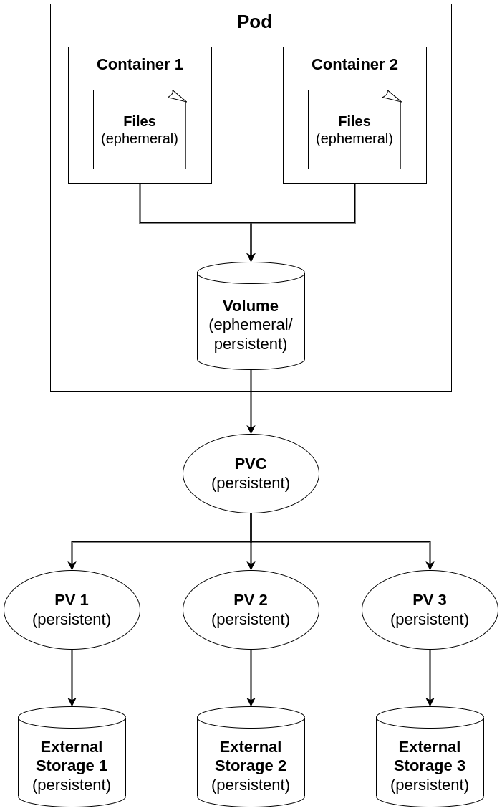

# Storage

- Files stored in a container will only live as long as the container itself

- Pod Volumes can be used to allocate storage that outlives a container and stays available during pod lifetime

- A `Persistent Volume (PV)` allows pods to connect to external storage and can exist outside of pods as well

- To use Persistent Volumes (PV), `Persistent Volume Claims (PVC)` are used to request access to specific storage

- `ConfigMap` are specific volume objects that connect to configuration files and variables

- `Secrets` do the same, but by encoding the data they contain

## Configure Volumes

- First, decide if you want use a Pod-local Volume or a Persistent Volume

- to create a Pod-local volume, the Pod needs to define the volume in `spec.volumes`y.

- Next, the container mounts that volume in `spec.containers.volumemounts`

- For use of persistent volume, additional external objects are needed

- Many volume types are supported:

    - `emptyDir`: (temporary) creates a temporary directory on the host

    - `hostPath`: (persistent) persistently connects to host environment

    - `azureDisk`: 

    - `awsElasticDisk`

    - `gcePersistentDisk`

    - `nfs`

    - `gitrepo`

    - ...

## Persistent Volumes (PV)

- a `Persistent Volumes (PV)` is an independent object that connects to external storage
    
    - user `persistentVolume` to define it
    - It can point to all the storage types

    - Use `persistentVolumeClaims` to create a definition of the kind and type of storage that needed

    - The `Persistent Volume Claim` talks to the available backend storage provider and dynamically uses volumes that are available on that storage type

- The PVC will bind to a PV according to the availability of the requested volume `accessModes` and capacity